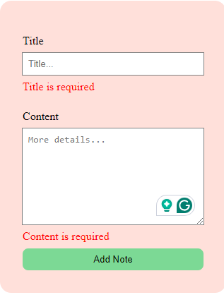

# My Notes App

This a web app for creating and managing your notes.

## Home page

This page shows all the notes

## Single note page

This page shows a single note in details and allows actions such as edit and delete to be performed

## Edit Note page

This page allows a note to be edited

## Create Note page

This page allows user to create a note

# Actions

## Navbar

Allows user to navigate both to home page and to create note page.

## Hover & Click on a note in home page

Hovering over a note will highlight the note and clicking on the note will redirect to a page that will show more details

## Action buttons in a single note page

- The arrow back button navigates the user to the homepage
- The Edit button redirect the user to the Edit note page where the user can update the note
- The delete button will prompt confirmation whether the user wants to delete the note. If option no is chosen then the note will not be deleted but if yes is chosen the note will be deleted and the user will be redirected after 2 seconds back to homepage. User is notified that delete is successful.
  
  

## Updating a note

- If no changes have been made, a notification is shown that says no changes were made
  
- If changes have been made, updating will show the notification then redirect home after 2 seconds
  

## Creating a note

- Form is validated on focus events and input
  
- Trying to submit an empty fied
  
- On success the message is displayed after which user is navigated home after 2 seconds
  
